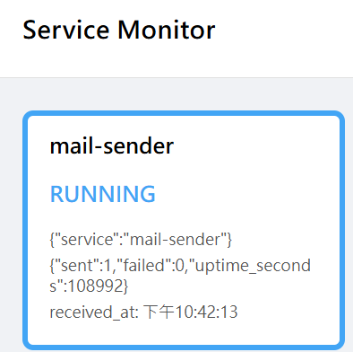
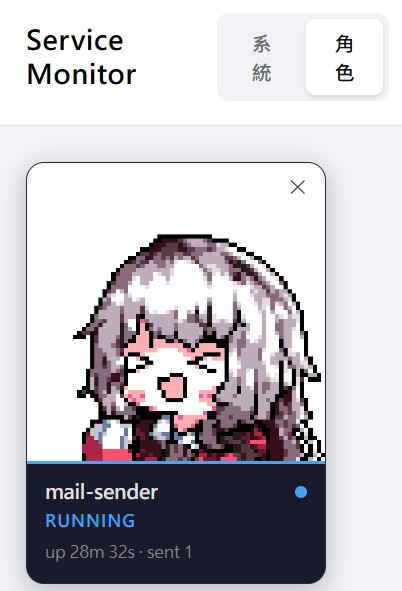

### 前言
今天來聊聊系統維護，現在有AI協助寫code，專案產生的速度正飛速增長，需要維護的系統也越來越多，以我個人開發經驗來說，沒有設計監控機制或經常使用系統，常常不知道專案是否有出現狀況，都需要手動翻看系統log才知道有錯誤。

網路上大多推薦透過grafana來監控系統狀況，有效是有效，但是我覺得設定報表相對麻煩，並且完全不有趣，平常也不會想要打開來看報表。
我想要找一種有趣、簡單並且符合自己開發習慣的系統監控工具。

### 理想
為了讓查看系統監控變得更生活化，

先看成果
這是文字版的監控畫面

這是角色版本的監控畫面，可以根據狀態有對應的動畫

